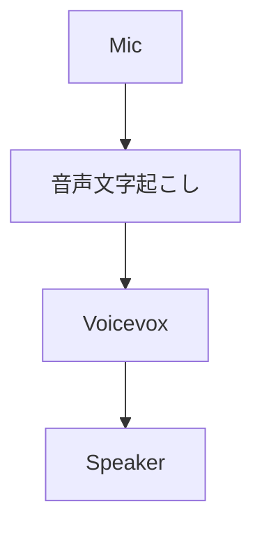
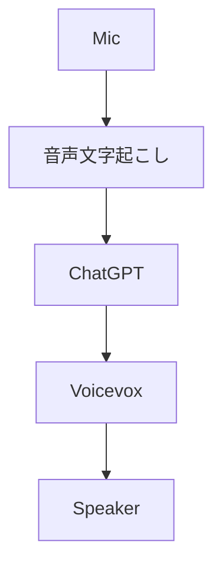

# gptVoivox

memo
## 仕様想定

### 第１想定
ボイスチェンジャー

```mermaid
graph TD;
  Mic --> 音声文字起こし
  音声文字起こし --> Voicevox
  Voicevox --> Speaker
```

### 第２想定
未定
### 最終目標
chatGPTと会話する．

```mermaid
graph TD;
  Mic --> 音声文字起こし;
  音声文字起こし --> ChatGPT;
  ChatGPT --> Voicevox;
  Voicevox --> Speaker;
```