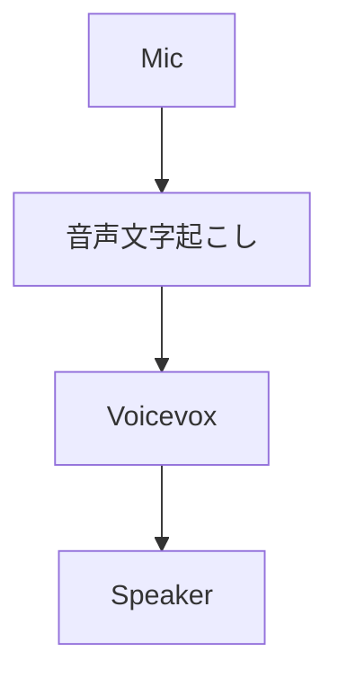
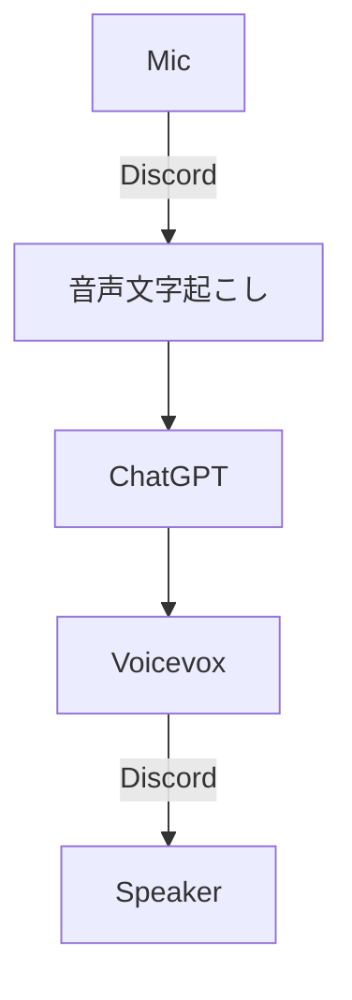

# gptVoivox

memo

## 概要
discordでchatGPTと会話したい

## memo
## 構想
### 第１想定
ボイスチェンジャー


### 第２想定
未定
### 最終目標
Discordを用いて，chatGPTと会話する．
多人数に対応出来ればいいな．



## 第一構想_構成，めも
### 

- venv mojiokoshi
  ```shell
  source mojiokoshi/bin/activate
  ```